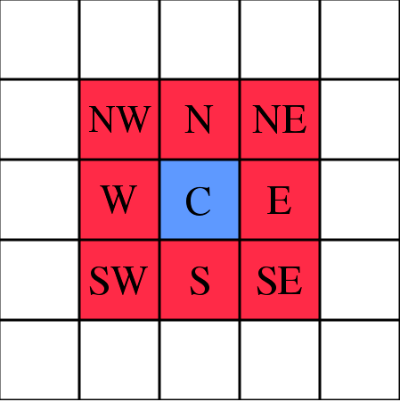

# Moore neighborhoods (8-connected)

A little library for generating [Moore neighborhoods] (i.e., the surrounding cells of a single cell in a grid)
of arbitrary range and dimensions. Or, the red edge squares for a blue center square:

[](https://en.wikipedia.org/wiki/File:Moore_neighborhood_with_cardinal_directions.svg)

The code was ported from [hughsk/moore] and adjusted for Rust features such as const generics.

[Moore neighborhoods]: https://en.wikipedia.org/wiki/Moore_neighborhood
[hughsk/moore]: https://github.com/hughsk/moore

## Usage example

```rust
use moore_neighboorhood::dynamic::moore;

fn example() {
    let mut result: Vec<Vec<isize>> = moore(1, 2);
    
    let mut expected = [
        [-1,-1], [ 0,-1], [ 1,-1],
        [-1, 0],          [ 1, 0],
        [-1, 1], [ 0, 1], [ 1, 1]
    ];

    result.sort();
    expected.sort();
    assert_eq!(result, expected);
}
```

Using const generics for the dimension:

```rust
use moore_neighboorhood::generic_dimension::moore;

fn example() {
    let mut result: Vec<[isize; 2]> = moore(1);
    
    let mut expected = [
        [-1,-1], [ 0,-1], [ 1,-1],
        [-1, 0],          [ 1, 0],
        [-1, 1], [ 0, 1], [ 1, 1]
    ];

    result.sort();
    expected.sort();
    assert_eq!(result, expected);
}
```
